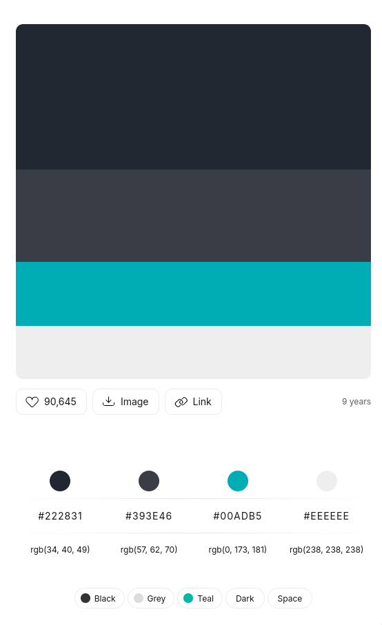

# The UI is built in react native using expo

## Installation
To install run the following bash command:
```bash
npm install
```

To run the expo commands look at all the commands in package.json file. Here is an example to start the frontend:
```bash
npx expo start
```

## For styling
- Using `react-native-paper` libary
- Color scheme being used is as below and present in this file `app-ui/app/components/taskView.tsx` ]
